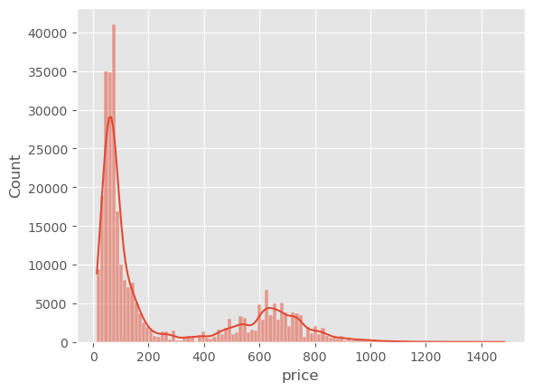
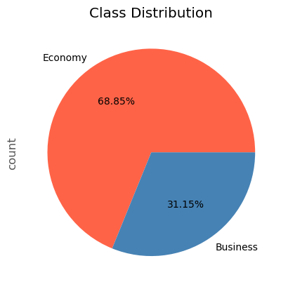
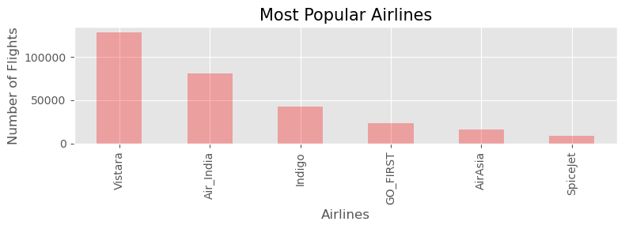

# FlyPrice: Analyzing and Forecasting Flight Fares

## 1. Title and Author
- **Project Title:** FlyPrice: Analyzing and Forecasting Flight Fares
- **Prepared for:** UMBC Data Science Master Degree Capstone by Dr. Chaojie (Jay) Wang
- **Author Name:** Sai Rahul Maddula
- **GitHub Repository:** [https://github.com/rahulmaddula3/UMBC-DATA606-Capstone]
- **LinkedIn Profile:** [Add Link]
- **PowerPoint Presentation:** [Add Link]
- **YouTube Video:** [Add Link]

---

## 2. Background
- **What is FlyPrice?**  
  FlyPrice leverages machine learning to predict flight ticket prices, helping travelers book cost-effective flights and assisting businesses in understanding pricing trends. Using over 300,000 flight booking records, FlyPrice analyzes factors like airline, departure time, number of stops, and days left to forecast fares in USD. The goal is to make air travel more accessible and economical for users.

- **Why is it Important?**  
  Flight prices often fluctuate due to demand, seasonality, and timing, creating uncertainty for travelers. Predictive modeling enables:
  - **Travelers:** Helps users save money by optimizing booking decisions.
  - **Airlines and Businesses:** Offers insights into customer behavior and allows strategic adjustments to maximize revenue.

- **Research Questions:**
  1. How can historical flight booking data be used to predict ticket prices?  
  2. What are the most important factors influencing flight fares?  
  3. How does the combination of airline, departure time, and stops impact price variation?

---

## 3. Data
- **Data Sources:** EaseMyTrip dataset.
- **Data Size:** ~300,261 rows.
- **Data Shape:** Rows: 300,261 | Columns: [Number of Columns].
- **Time Period:** [Add Time Period].
- **What does each row represent?** Each row represents one flight booking option.

- **Data Dictionary:**

| Column Name       | Data Type | Definition                           | Potential Values                                |
|--------------------|-----------|---------------------------------------|------------------------------------------------|
| Airline           | Object    | Name of the airline                  | 'SpiceJet', 'AirAsia', 'Vistara', etc.         |
| Flight            | Object    | Unique flight number                 | Unique alphanumeric values                     |
| Source City       | Object    | Origin city of the flight            | 'Delhi', 'Mumbai', 'Bangalore', etc.           |
| Departure Time    | Object    | Time category for departure          | 'Morning', 'Evening', 'Night', etc.            |
| Stops             | Object    | Number of stops on the flight        | 'Zero', 'One', 'Two'                           |
| Arrival Time      | Object    | Time category for arrival            | 'Afternoon', 'Night', etc.                     |
| Destination City  | Object    | Destination city of the flight       | 'Delhi', 'Mumbai', 'Bangalore', etc.           |
| Class             | Object    | Ticket class                         | 'Economy', 'Business'                          |
| Duration          | Float     | Duration of the flight in hours      | Numeric values (e.g., 2.17, 49.83)             |
| Days Left         | Integer   | Days remaining until the flight      | Integer values (e.g., 1, 49)                   |
| Price             | Float     | Ticket price in USD                  | Numeric values (e.g., 13.1, 1458)              |

- **Features/Target:**
  - **Target:** `price`
  - **Features:** `airline`, `departure_time`, `stops`, `days_left`

---

## 4. Exploratory Data Analysis (EDA)

### 1. Distribution of Ticket Prices
The distribution of flight prices is heavily skewed to the right, with most ticket prices concentrated in lower ranges. This skewness indicates that the dataset primarily includes affordable flight fares, but there are also premium-priced tickets.

---

### 2. Airline Distribution
The dataset contains flights operated by six airlines. Vistara dominates the market with 42.6% of the share, followed by Air India (27%) and Indigo (14.4%). Airlines like SpiceJet, AirAsia, and GO_FIRST have smaller market shares.

---

### 3. Class Distribution
The majority of the flights in the dataset are in the Economy class (68.85%), while Business class flights account for 31.15%.

---

### 4. Stop Analysis
The average ticket price varies with the number of stops. Flights with one stop tend to be more expensive than direct flights or flights with two or more stops.

---

### 5. Airline Prices Based on Class
A comparison of ticket prices by airline and ticket class shows that Business class fares are significantly higher than Economy class fares, particularly for airlines like Air India and Vistara.

---

### 6. Economy Class Ticket Prices by Airline
The boxplot shows the distribution of Economy class ticket prices for each airline. Air India and Vistara offer higher-priced Economy tickets compared to budget carriers like AirAsia and SpiceJet.

---

### 7. Business Class Ticket Prices by Airline
The boxplot shows the distribution of Business class ticket prices for Air India and Vistara. Business fares are substantially higher, reflecting the premium service provided.

---

### 8. Most Popular Airlines
This bar chart displays the number of flights per airline in the dataset. Vistara and Air India operate the highest number of flights.

---

### 9. Average Price by Days Left
As the number of days left until departure decreases, the average ticket price increases sharply, emphasizing the importance of early bookings for cost savings.

---

### 10. Top 10 Most Expensive Flights Between Cities
This chart highlights the most expensive flight routes in the dataset. The routes between certain cities, such as Chennai and Mumbai, are among the costliest.

---

## 5. Model Training
- **Models Used:**
  - Random Forest Regressor
  - XGBoost
  - Linear Regression
- **Training Setup:**
  - Train/Test Split: 80/20
  - Libraries: scikit-learn, pandas, numpy
  - Environment: Jupyter Notebook and Streamlit
- **Performance Metrics:**
  - Mean Absolute Error (MAE)
  - Root Mean Square Error (RMSE)
  - R² Score

---

## 6. Application of the Trained Models
- **Web App Development:**
  - Tool: Streamlit
  - Features:
    - Input parameters (airline, departure time, stops, days left).
    - Display predicted price.
    - Show feature importance visualization.

---

## 7. Conclusion
- **Summary:**
  - Successfully predicted flight prices with high accuracy.
  - Identified `airline` and `days_left` as the most significant predictors.
- **Limitations:**
  - Limited to a specific region and dataset.
  - Doesn’t account for real-time price changes.
- **Future Research:**
  - Incorporating real-time data scraping.
  - Adding features like passenger demand and seasonal trends.

---

## 8. References
- Dataset: [EaseMyTrip](#)
- Libraries: scikit-learn, Streamlit
- Visualization Tools: Plotly
- Related Research Articles: [Add Links]

